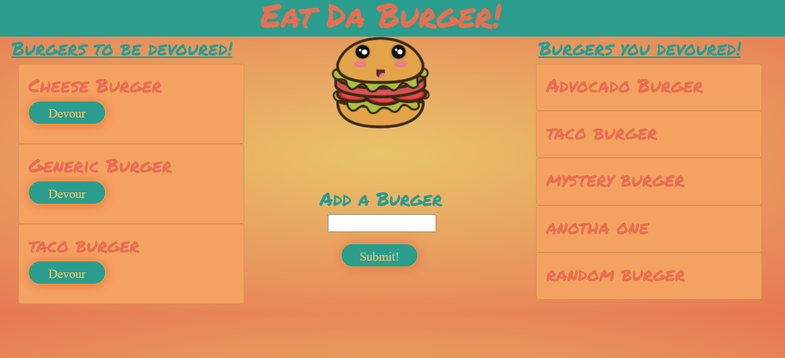

# Burger 

  

  ##  Description
  
  This app will allow the user to devour burgers, and add new burgers to be devoured when they see fit. The app will show all previously devoured burgers in another column. This will be done by using, mysql for the database, express for the api/routes, handlebars for the view, and by using orm functions.

  ## Table Of Contents

  * [Installation](#installation)
  * [Usage](#usage)
  * [Credits](#credits)
  * [License](#license)

  ## Installation

  npm i

  ## Usage

  used to display and add burgers to be devoured.

  ## Credits

  N/A

  ## Test

    node server, in cmd prompt after installation.

  ## License

  MIT

## Questions

  for any questions or inquiries  please feel free to message me on Github at: https://github.com/marchandmr

  or you can send me an E-mail :  marchandmr@icloud.com

 

 
